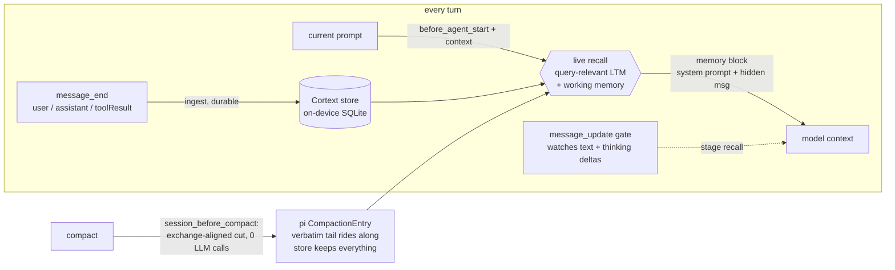

# Cortext for Pi

[](./LICENSE)

**Living memory for the [pi coding agent](https://pi.dev) — and compaction
for free.** Every message is written to a native, on-device memory engine
([`@augmem/cortext`](https://github.com/augmem/cortext)) as the conversation
happens, and every turn re-queries that memory live against the current
prompt. So when the context window fills up, nothing has to be summarized —
nothing was being thrown away in the first place.

A port of [`@augmem/cortext-openclaw-plugin`](https://github.com/augmem/cortext-openclaw-plugin)
to pi's extension surface: same memory loop, same architecture, same test and
proof standards — on the events the harness actually emits.

```bash
# dev install (package is not on npm yet)
git clone <this repo> ~/.pi/agent/extensions/cortext
cd ~/.pi/agent/extensions/cortext && npm install && npm run build
# then restart pi — the extension is auto-discovered
# (equivalently: pi -e /abs/path/to/dist/index.js for a single run)
```

## Why

- **Recall on every turn, not just after compaction.** Each assembly queries
  memory live with the current prompt — what gets injected is relevant to
  what's being asked *right now*, and a correction made this turn is
  reflected on the next (no cross-turn cache, no frozen digest). Recall runs
  on two surfaces: the system prompt (per user prompt) and a hidden per-LLM-call
  message (so mid-run tool loops get fresh recall too). Mid-turn, a streaming
  gate watches the model's reasoning and answer as they stream and can stage
  recall for the next assembly.
- **Compaction with zero LLM calls.** Pi's native compaction pays a
  summarizer every time the window fills and hopes the summary kept what
  you'll need. Cortext compaction just moves a window: the extension returns
  its own `CompactionEntry` (bridge note + exchange-aligned cut, `fromHook: true`)
  and **no summarizer LLM call is made** — verified live (the compaction
  response carries no `usage`). Archived content comes back through
  query-relevant recall every turn.
- **Measured, not vibes.** The live bench ([`bench/live.mjs`](bench/live.mjs))
  runs a real `pi` session over RPC and proves the loop end-to-end: after an
  extension compaction archives the exchange containing a nonsense-token
  codename, the transcript shows the codename exists **only** in the archived
  prefix, and the next turn answers it from memory injection alone. Run it:
  `npm run test:integration`.
- **Fast enough to forget it's there.** Median 2.74 ms per-message durable
  ingest (mean 2.78 ms, p95 3.21 ms; N=200, warm store, 200-char messages,
  `node bench/latency.mjs`), fully offline after a one-time model download,
  no per-turn network, no API keys.
- **Isolated by default.** One SQLite store per conversation — a shared
  project agent can't leak one user's facts to another. Verified live with
  positive and negative controls (a different session *cannot* read the
  fact; the same scope *does*).
- **The transcript is never mutated.** Compaction is a pi-native entry that
  pi appends to the session file — the extension only chooses the cut and
  supplies the bridge summary. No destructive surgery.

## The loop



Recall runs from turn one; compaction only changes how much verbatim tail
rides along — the memory side never changes.

## Compaction

Cortext answers pi's `session_before_compact` with its own compaction —
pi's own summarizer is never called. Because every message is already in the
durable store (`message_end` ingest), the returned `CompactionEntry` just
picks an exchange-aligned cut (a user-message entry, so the kept tail is a
self-contained exchange — never a tool result orphaned from its call) and
carries a bridge note in `summary` plus its provenance in `details`
(`engine: "cortext"`, mode, dropped count). pi then natively rebuilds the
model context from that entry — summary + entries from `firstKeptEntryId`
onward — so the archived prefix simply stops riding along, and it keeps
coming back through query-relevant recall.

This is where the port diverges from the openclaw plugin in one deliberate
way: pi owns the kept window natively (its `buildContextEntries` reconstructs
from the compaction entry), so the openclaw plugin's own anchor/state
self-healing machinery was **not** ported — there is no second shadow window
to keep consistent.

Two modes (`compactionMode`):

- **`hybrid`** (default) — keep the system prompt + memory injection + a
  verbatim tail of the last `protectTail` messages, walked back to a
  user-message boundary so the tail is a self-contained exchange.
- **`full`** — keep the system prompt + memory injection only; the verbatim
  window shrinks to the current exchange. Maximum savings — memory IS the
  context.

If there is nothing before the protected window to archive, the extension
returns `undefined` and pi's default compaction applies — memory never
vetoed a compaction it had no content behind.

## How it plugs in

Four pi surfaces (verified against the installed `pi` 0.84.2 `dist/` types,
not docs — see `src/pi.d.ts`):

1. **Ingest** — `message_end` (user, assistant, toolResult). Tool-call
   arguments are rendered as `[tool call] name {args}` truncated at 2,000
   chars in the durable record (the command matters; a 100 KB patch payload
   shouldn't dominate the store); tool *results* are ingested in full.
2. **Recall** — `before_agent_start` appends a fenced memory block to the
   (chained) system prompt per user prompt; `context` (fires before every
   LLM call) appends a `display: false` custom message carrying only
   memories not already in that run's system-prompt block, plus — once a
   compaction entry is in context — the live working-memory snapshot
   deduplicated against the kept window. Both drain recall the streaming
   gate staged, under the same scope key.
3. **Compaction** — `session_before_compact` returns the extension compaction
   (zero LLM calls) or `undefined` (see above).
4. **Streaming gate** — `message_update` feeds `text_delta` /
   `thinking_delta` through Cortext's interrupt gate. On
   `should_interrupt` / `at_boundary` the recalled memory is staged on a
   bounded bus keyed by scope, for the next assembly. Observe-only — see
   [limits](#design-and-limits).

## Install & configure

pi has no per-extension config surface (verified against the installed
0.84.2 `Settings` types), so config resolves in order:

1. `CORTEX_PI_CONFIG` env var (JSON object) — wins
2. `~/.pi/agent/cortext/config.json`
3. defaults (a malformed source is skipped, never fatal: memory must not
   break the agent)

Resolution happens once when the extension registers — there is no config
watching; restart pi to apply changes.

| Key | Default | Meaning |
|-----|---------|---------|
| `dbPath` | `cortext` | Directory (under `~/.pi/agent/cortext`) for stores; `'.'`/`'..'` fall back to `cortext` (traversal guard) |
| `memoryScope` | `session` | Isolation boundary: `session` / `agent` / `global` |
| `focus` | `0.45` | F knob: retrieval breadth vs precision |
| `sensitivity` | `0.5` | S knob: affective relaxation of the gate |
| `stability` | `0.5` | T knob: gate refractory + boundary pacing |
| `recallLimit` | `12` | max memories injected per assembly |
| `interruptGate` | `true` | run the streaming gate |
| `ingestReasoning` | `true` | feed `thinking` deltas, not just answer text |
| `autoConsolidate` | `true` | consolidate on compaction |
| `compactionMode` | `hybrid` | `hybrid`: memory + verbatim tail; `full`: memory only |
| `protectTail` | `6` | hybrid: trailing messages kept verbatim (exchange-aligned) |

Requirements: Node.js ≥ 18; a platform with a `@augmem/cortext` native
prebuild (installed as a dependency). On first use Cortext downloads its
local model assets once; after that, memory runs fully offline.

## Isolation

Cortext keeps one SQLite store **per isolation scope** — source ids are
metadata within a store, so distinct scopes are distinct databases (staged
gate memory is keyed by the same scope, so it can't cross the boundary
either). `memoryScope`:

- **`session`** (default) — one store per session
  (`ctx.sessionManager.getSessionId()`). Safe when an agent serves multiple
  people: memory never crosses conversations.
- **`agent`** — one store per project (`safe(basename(cwd))`, `main` when
  absent) — memory persists across that project's sessions. Use only for
  **single-user** projects. Note the identity is the cwd basename: two
  projects with the same folder name share a store (documented trade-off;
  pi has no stable project id in the extension context).
- **`global`** — a single shared store.

Both session isolation (positive + negative controls) and scope-key
determinism are asserted by the unit suite; live session isolation — with a
nonsense-token needle a model can't guess — is asserted by
[`bench/live.mjs`](bench/live.mjs).

## Design and limits

- **Recalled memory is untrusted input.** A prior turn could have ingested a
  prompt-injection payload. Before injection, recalled text is stripped of
  data-fence breakouts and fake system markers, and wrapped in a block that
  explicitly labels it as reference data, not instructions. This is a
  mitigation, not a guarantee.
- **Fine-grained recall is a work in progress.** Retrieval reliably brings
  back conversationally salient facts (decisions, named results, user
  statements); one-off identifiers buried in bulk tool output are hit or
  miss (same state as the openclaw plugin and the underlying engine — see
  its release notes for needle-probe trends).
- **The gate cannot splice into a live decode, and cannot request a
  re-pass.** Pi's agent event stream is observe-only and has no
  `before_agent_finalize`-equivalent hook, so on interrupt the extension
  stages recall for the *next* assembly and that is the whole re-pass story.
  The openclaw gateway's `revise` behavior (the `forceRepass` key) has no
  pi counterpart and is deliberately out of scope here.
- **Tool-call arguments are truncated at 2,000 chars** in the durable record;
  tool *results* are ingested in full.
- **The engine's consolidation hint is deliberately not acted on at ingest.**
  Compact-time consolidation is the sufficient, safe cadence (openclaw
  parity; measured retrieval is identical with or without the hint).
- **pi owns the window.** After a Cortext compaction, the kept window is
  whatever pi reconstructs from the entry; the extension does not (and cannot)
  re-window on every assembly the way the openclaw context engine did. The
  per-LLM-call recall surface compensates: once windowed, the working-memory
  snapshot rides along with every recall call.
- **An engine that can't open degrades its scope, not the agent.** If the
  native store cannot be opened for a scope (missing store dir, corrupt DB
  file, binding rejection), that scope degrades to recall-less passthrough
  with a one-time `cortext store error` log line per scope — the agent keeps
  running, and memory for that scope stays off for the rest of the pi process
  lifetime: there is no automatic retry, so restarting pi re-attempts the
  store open.
- **Telemetry is spans only, and fully offline.** Control and failure paths
  emit OpenTelemetry spans via `@opentelemetry/api` (a no-op proxy when no
  collector/SDK is present), so the extension stays fully offline with no
  per-turn network and no new diagnostics dependencies beyond the OTEL API;
  span attributes are bounded enums/numbers only.

## Verified

Every release passes, against a real `pi` 0.84.2 installation and the
shipped engine, before publish:

- **Unit + types** — `npm run typecheck` and `npm test` (83 tests, native
  engine, offline): config resolution, store/scope-key determinism, engine
  ingest/recall/consolidate, compaction cut logic (exchange alignment,
  previous-boundary floor, fallback), stream-gate segmentation/staging,
  bus bounding, plus pi-surface tests for the handler set (ingest mapping,
  recall injection shapes, zero-LLM compaction result, shutdown flush).
  `scripts/verify-entry.mjs` asserts the factory registers exactly the
  expected handlers against a stub `ExtensionAPI`.
- **Live loop** — `npm run test:integration` (`bench/live.mjs`) drives a real
  `pi --mode rpc` session in an isolated temp project (own `--session-dir`,
  `--no-extensions`, `--approve`'d project-level compaction settings, unique
  `CORTEX_PI_CONFIG` dbPath — which also proves the env config path) and
  asserts, per control:
  - **compaction-zero** — `compact` yields an extension-provided
    `CompactionEntry` (`details.engine="cortext"`, `fromHook: true`)
    with **no `usage`** (zero summarizer LLM calls)
  - **compaction-window** — the needle entry is provably before
    `firstKeptEntryId` on the branch (archived, exchange-aligned cut)
  - **recall-post-compaction** — the next turn answers the needle, which
    exists only in the archived prefix (memory injection is the only source)
  - **isolation-session / isolation-store** — a different live session (and a
    fresh handle on its store) cannot read the fact; the same scope can
    (positive control)
  - **ingest-durable** — a *fresh* handle on the same SQLite DB recalls the
    needle (cross-process durability)
  - **gate-observe / ingest-mechanism** — the streaming gate observed
    assistant messages and processed turns with zero handler errors
    (interrupt/boundary fires are state-dependent; observed fires are
    reported as evidence, e.g. `gate fires=48`)

Verified live twice in a row (both `8/8`), with
`qwen3.8/Qwen3.8-27B` at `thinking=low`, pi 0.84.2:

```text
PASS  compaction-zero (extension CompactionEntry, no summarizer LLM call)
PASS  compaction-window (needle provably archived, exchange-aligned cut)
PASS  recall-post-compaction (archived-only needle answered from memory)
PASS  isolation-session (different session cannot read the fact, live model check)
PASS  ingest-durable (fresh handle on S1 store recalls the needle)
PASS  isolation-store (fresh handle on S2 store does NOT recall the needle)
PASS  gate-observe (streaming gate observed, no handler errors)
PASS  ingest-mechanism (extension active, recall injected, no handler errors)
bench: 8/8 controls passed
```

(The live bench needs a configured model for the pi session; it makes real
LLM calls but no compaction summary call.)

## Develop

```bash
npm install
npm run build       # tsc → dist/
npm run typecheck
npm test            # build + unit tests (native engine; fast, offline)
npm run test:integration   # live bench against the installed pi
```

`npm test` includes a build-reproducibility gate (`npm run build:verify`
diffs a fresh tsc emit against `dist/`), a dependency-inventory gate
(`npm run notice:verify` fails when a `package.json` runtime dependency is
not named in `NOTICE`), and a test-count gate
(`npm run testcount:verify` fails when the README Verified test count
drifts from `tests/*.test.mjs`); a GitHub Actions CI workflow
runs typecheck, the full test chain, and `npm audit`.

`src/pi.d.ts` is transcribed from the **installed**
`@earendil-works/pi-coding-agent` package's `dist/` types — if pi's
extension surface changes, the transcription is re-verified against the real
package, not docs.

## License

Apache-2.0. See [LICENSE](./LICENSE) and [NOTICE](./NOTICE).
